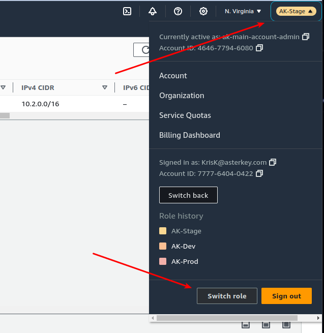
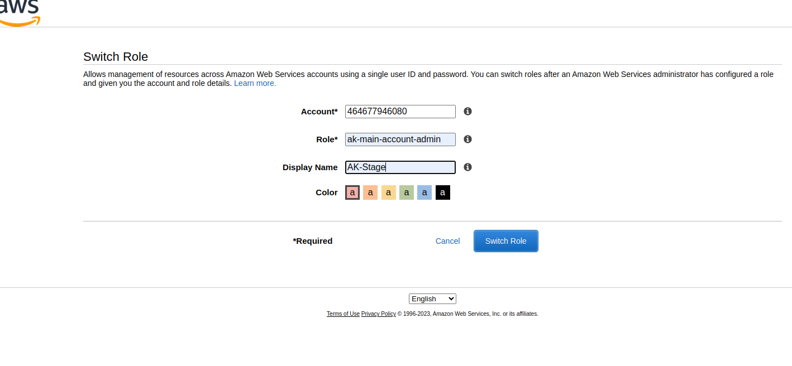
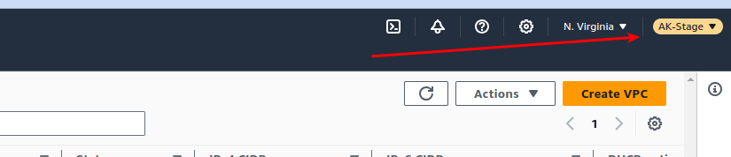
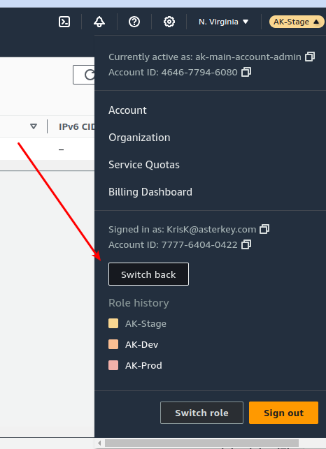

# Using AWS Assume Role to move between accounts.

**NOTE: this functionality will change slightly once SSO is introduced to the environment.**

The IAM STS::AssumeRole functionality allows a user or group from one account to access resources in a separate account. This can be within one AWS Organization or between unrelated orgs/accounts.

Using this functionality, a multi-account Org can be created with users & groups defined in one, and roles and permissions created in the other accounts that the central users can ‘assume’. This allows us to keep a central repository of users and groups with fine-grained control over what each can do in the sub-accounts.

In this model, users are consolidated into groups, and groups are permitted to assume specific roles that have permission sets applied to them.

In order to assume roles in the other account, you must set up MFA on your Main account ID.

## Setting up MFA

After you complete setting up your MFA, you must log out of AWS & then back in using your new password & MFA token. MFA authenticated sesssions are required to do anything in the console besides changing your password and MFA options.

1. In your browser, navigate to the AWS Console sign in page and enter the credentials you were provided.

2. Once signed in, click the Services link in the top nav bar, then enter IAM in the text box. Select IAM.

3. On the Identity and Access Management(IAM) page, select the Users links.

4. On the Users page, find and select your user. Click the name, not the checkbox.

5. On your user page select the Security credentials tab, then click 'Manage' to the right of Assigned MFA device.

6. Select Virtual MFA device, then Continue.

You will be presented with QR code. Scan this QR code with your MFA application, then follow directions from there. Once you scan the bar code you will have to enter 2 successive MFA codes into the AWS screen to ensure the device is synchronized.

## Assuming roles in the different AWS accounts

You must log in (with MFA) to the master/main Aster Key AWS account. This is your 'jumping-off' point.

**Note: Assumed roles are 'book marked' in you AWS console once you set them up, so you only have to do this one time.**

| Account Name | Name in AWS Console | Account ID   | Assumable Role        |
| ------------ | ------------------- | ------------ | --------------------- |
| AK           | AK                  | 777764040422 | ak-main-account-admin |
| production   | Production          | 380735047240 | ak-main-account-admin |
| develop      | Development         | 228923425684 | ak-main-account-admin |
| staging      | Staging             | 464677946080 | ak-main-account-admin |

From your MFA authenticated session in the main AK account:

1. Access your account menu in the upper right-hand portion of the AWS console and select ‘Switch Role’

2. On the Switch Role screen, enter the account number you wish to switch to (see table above), the ‘assume role’ your group is assigned in the account (see table above), and a ‘local friendly’ name to save this configuration as, then click ‘Switch Role’. The ‘local friendly’ name will appear in the Role History section of menu for quick access later, so name each account/role accordingly.

If you entered the correct information you should be in the ‘Assumed’ role in the target account.
Your current role will be displayed in the same place as your account menu.

To switch back to your main account, click the new ‘current-role' menu and select 'Switch Back'

If you have multiple switch-role accounts in the Role History you can jump between them directly.
